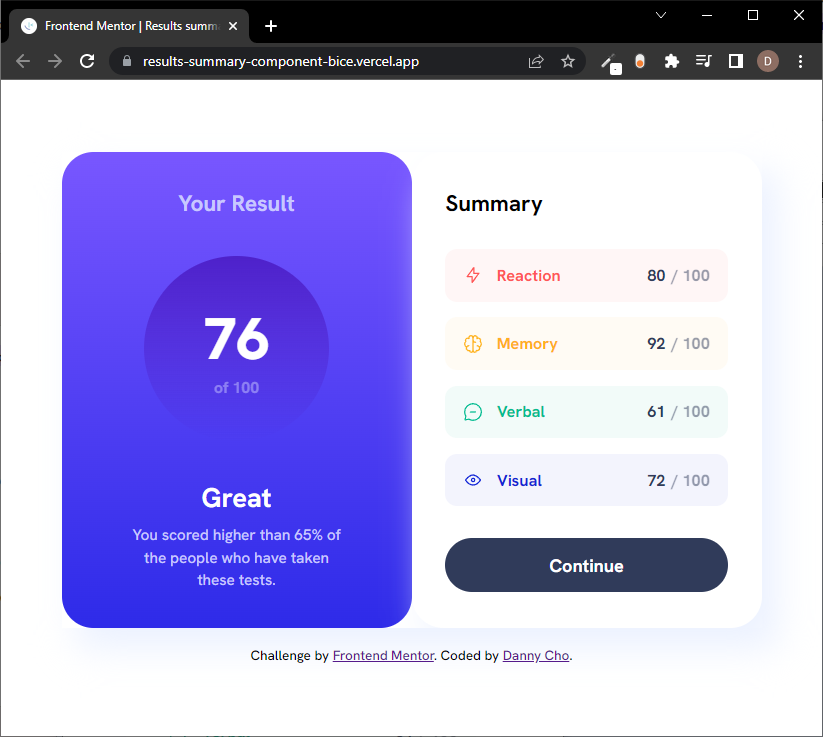
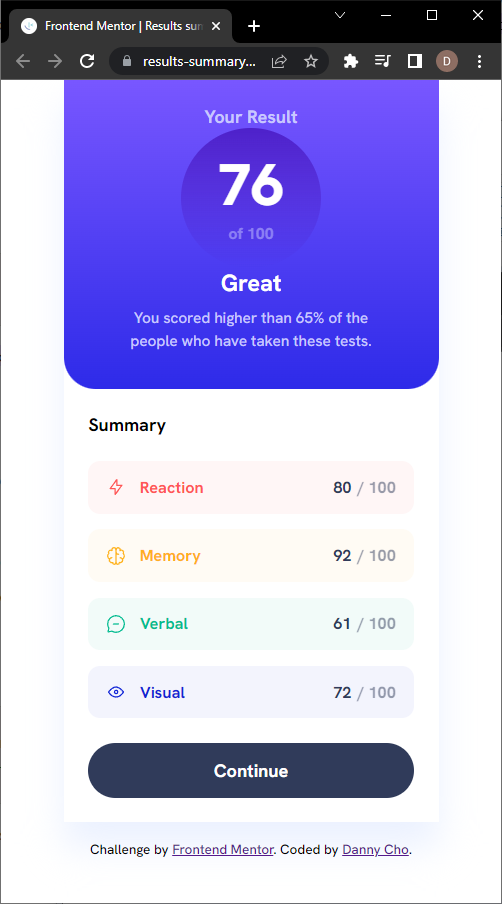

# Frontend Mentor - Results summary component solution

This is a solution to the [Results summary component challenge on Frontend Mentor](https://www.frontendmentor.io/challenges/results-summary-component-CE_K6s0maV). Frontend Mentor challenges help you improve your coding skills by building realistic projects. 

## Table of contents

- [Frontend Mentor - Results summary component solution](#frontend-mentor---results-summary-component-solution)
  - [Table of contents](#table-of-contents)
  - [Overview](#overview)
    - [The challenge](#the-challenge)
    - [Screenshot](#screenshot)
    - [Links](#links)
  - [My process](#my-process)
    - [Built with](#built-with)
    - [What I learned](#what-i-learned)
    - [Continued development](#continued-development)
    - [Useful resources](#useful-resources)

## Overview

### The challenge

Users should be able to:

- View the optimal layout for the interface depending on their device's screen size
- See hover and focus states for all interactive elements on the page

### Screenshot

### Links

- [Solution URL](https://github.com/danheecho1/FEM_results-summary-component)
- [Live Site URL](https://results-summary-component-bice.vercel.app/)

## My process

### Built with

- HTML5
- CSS with custom properties and BEM
- Flexbox
- CSS Grid
- Mobile-first workflow

### What I learned

- If possible, avoid using margin to adjust placements. Instead, use padding, flex (gap, justify-content, align-items), or grid. 
- hsl can also take in a fourth value for alpha (hsla) to manipulate opacity. 

### Continued development

- For this design, grid might have been a better solution vs. flex. I will need to get more comfortable with grid. 
- This project provided the font in assets, but I didn't know how to use it (@font-face). I will need to look into the pros and cons of using ttf files vs. importing from Google. 

### Useful resources

- [Kevin Powell](https://www.youtube.com/watch?v=KqFAs5d3Yl8&t=1283s&ab_channel=KevinPowell) - The way Kevin organizes his CSS codes seems very scalable and maintainable. He also uses custom attributes in his HTML codes to dynamically(?) change background colors. 
